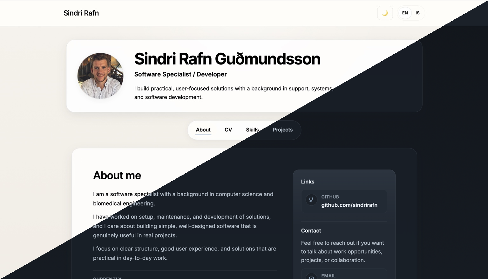

# Personal Portfolio Website

A modern, responsive developer portfolio built to showcase my projects, skills, and experience in a clean and interactive way.

This project focuses on simplicity, performance, and a polished user experience — with support for light/dark mode, smooth transitions, and a structured presentation of content.

---

## ✨ Features

- Clean, modern UI design
- Light / Dark mode with smooth transitions
- Responsive layout (desktop & mobile)
- Interactive sections:
  - About
  - Skills
  - Projects
  - Contact
- Dynamic project showcase
- Structured and reusable component-based architecture

---

## 🧱 Tech Stack

- React
- JavaScript (ES6+)
- CSS (custom styling)
- Vite (build tool)

---

## 📂 Project Structure
```text
src/
│
├── components/     # Reusable UI components
├── sections/       # Page sections (About, Skills, Projects, etc.)
├── data/           # Static data (projects, skills, etc.)
├── assets/         # Images and media
└── App.jsx         # Main app entry
```
---

## 🚀 Getting Started

### 1. Clone the repository

```bash
git clone https://github.com/sindrirafn/my-website.git
cd my-website
```
---
### 2. Install dependancies
```bash
npm install
```
---
### 3. Run the development server

```bash
npm run dev
```

The site will be available at: 


```code
http://localhost:5173
```

---
## 🎯 Purpose

This project was built to:
- Showcase my development skills in a practical way
- Present my projects in a clean and accessible format
- Serve as a central hub for my work and experience
- Practice modern frontend development patterns

---

## 🧠 Design Philosophy
- Clarity over complexity — simple, readable layout
- Performance-focused — lightweight and fast
- User-first — intuitive navigation and interaction
- Consistency — reusable components and styling

---

## ⚙️ Future Improvements
- Add animations and micro-interactions
- Improve accessibility (ARIA, keyboard navigation)
- Add CMS or dynamic content handling
- Expand project showcase with more detailed case studies

---

## 📸 Preview



---

🔗 Live Version

...

---

👤 Author

Sindri Rafn Guðmundsson

---

📄 License

This project is for personal portfolio use.

